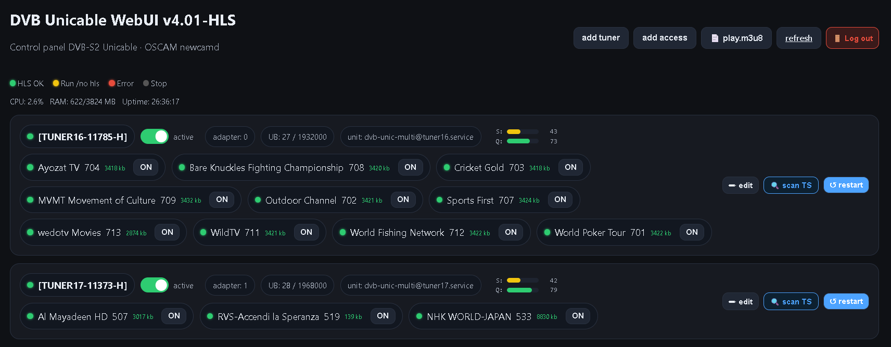

# Streamer HLS
> by **SatBone**

Streamer HLS is a lightweight SAT-to-HLS gateway designed for hospitality TV systems using DVB-S2 and JESS / Unicable II.

Streamer HLS started as a personal hobby project focused on receiving DVB-S2 satellite channels and publishing them as standard HLS streams.
Over time, it evolved into a lightweight streaming solution for hospitality TV systems and IPTV deployments.

The project was created with simplicity in mind.

Instead of requiring powerful servers or complex container environments,
Streamer HLS is designed to run reliably even on modest hardware such as
small thin clients equipped with PCIe DVB adapters.

> **Requirements**
>
> - Ubuntu Server 22.04 LTS
> - Supported DVB-S2 PCIe adapter
> - JESS / Unicable II installation

## Features

> Streamer HLS combines DVB reception, channel management and HLS streaming in a single lightweight application.

- DVB-S2 multi-adapter support
- JESS / Unicable II (EN50607)
- Per-channel HLS streaming
- Independent tuner services
- Lightweight Web Control Panel
- IP access control
- Channel scanning
- Low resource usage

---

## Why Streamer HLS?

> **Satellite streaming shouldn't require enterprise hardware.**

Streamer HLS focuses on one task:

Receive DVB channels.

Publish HLS streams.

Stay simple.

---

## Installation

Installation consists of two simple steps.

1. Install DVB card drivers.
2. Reboot.
3. Install Streamer HLS.

The complete installation guide is available here:

https://....

---

## Documentation

Full documentation:

https://....
